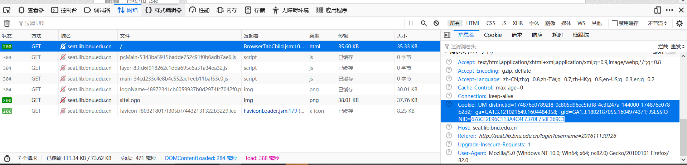
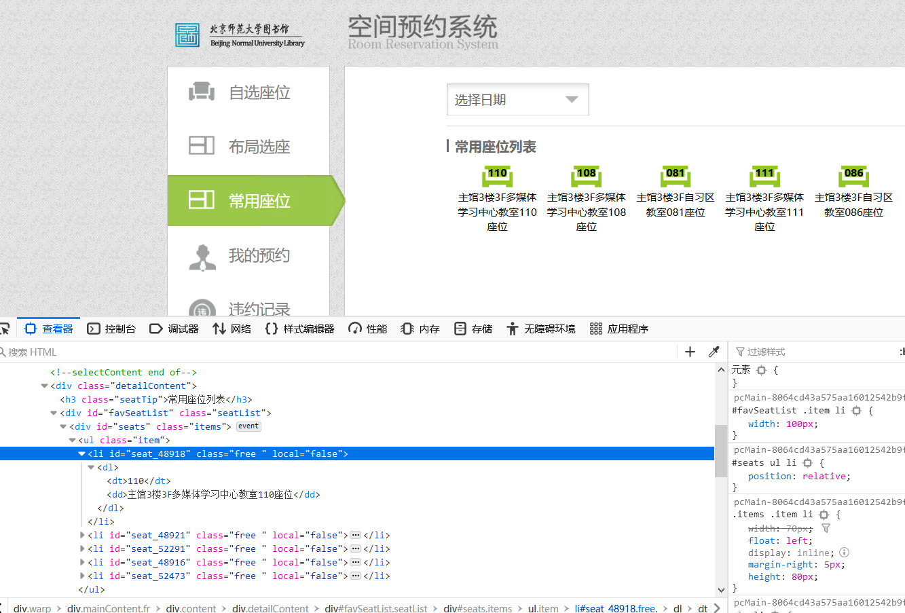

# Leosys-Helper


[北师大图书馆预约](http://seat.lib.bnu.edu.cn)助手，自用

半自动，19:30准点发送预约座位请求。

#### 环境

1. win10_64
2. [codeblocks-20.03mingw-setup](https://www.fosshub.com/Code-Blocks.html?dwl=codeblocks-20.03mingw-setup.exe)
3. ```*\CodeBlocks\MinGW``` 添加到path

#### 编译

``` mingw32-make```

#### 运行

```main.exe```

#### 日常编辑

##### main.cpp中：

日期：第二天的年月日。

##### UJessionid&Seatid.txt中：

1. JSESSIONID:  本次网页登陆的标志。

   浏览器打开[北师大图书馆空间预约系统](http://seat.lib.bnu.edu.cn)、F12调出页面工具、网络（Network）、刷新页面、找到GET seat.lib.bnu.edu.cn项、找到GET中的Cookies、Cookies里面的JSESSIONID（见下图"678CF2E96C113A4C4F7370F758F369C3"）。

   

   

2. seat座位号

   **UJessioinid&Seatid.txt必须和main.exe在同一目录下，并且每天编辑**

### 常用编辑：

##### 增加座位：

座位号：需要找到真正的座位号id。

浏览器打开[北师大图书馆空间预约系统](http://seat.lib.bnu.edu.cn)、找到想要的座位、右键检查元素、"seat_xxxx"（见下图"seat_48918"）中的xxxx就是真正的座位号。



添加到main函数最前方即可。

##### 调整时间

default_st_time, default_ed_time 这个是默认时间，默认8~22


